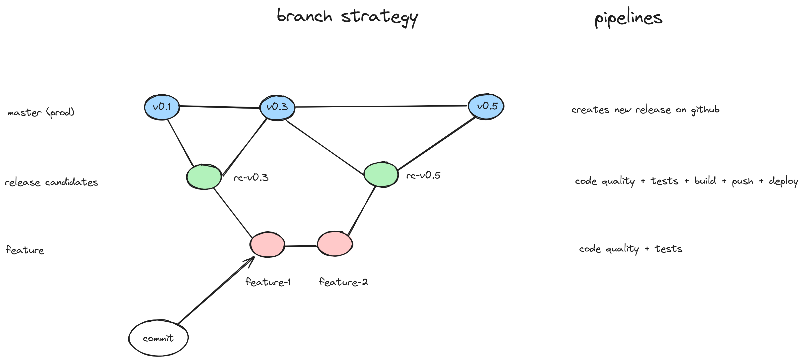
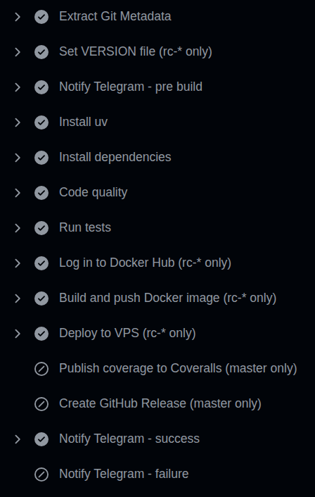

# python-seed-project


[](https://github.com/joagonzalez/python-seed-v2/actions/workflows/pipeline.yml)
[](https://python-seed-v2.readthedocs.io/en/latest/)
[](https://coveralls.io/github/joagonzalez/python-seed-v2?branch=master)

---
**Content**
- [Getting started](#getting-started)
- [Branch strategy](#branch-strategy)
- [Documentation](#documentation)
- [CICD Pipeline ](#cicd-pipeline)
- [Build](#build)
- [Run](#run)
    - [Local development](#local-development)
    - [Production](#production)
- [References](#references)
---

## Getting started

This project tries to implement an end to end python repository that includes CI/CD pipeline using **Github Actions**, code quality tools integration like uv, mypy, ruff, pytest and mkdocs for documentation using docstrings and typing within project source code.

Also, the template project is a REST API using FastAPI that expose basic calculator functions.

- Documentation: mkdocs with docstrings and typing at readthedocs service
- CI CD: **Github Actions** pipeline using **telegram** integration and custom branch strategy described below
- Deployment: Kubernetes based with minikube for local tests and remote deployment through pipeline.
- Code Quality: uv, ruff, mypy
- Testing: pytest

## Branch strategy
The following diagram describes the branch strategy used in the context of this template repository. The ideas was to simplify git flow due to it is oriented to single developer or very small teams with only one production stage.

The workflow consists of release candidate branches (rc-\*) that will be branched from master. Master branch will always have a tag with a tested and approved version which will be the result of a rc-\* branch merge. Developers will create feature branches (feature-<issue_number>-\*) from rc-\* branches.

Events:
- commit on feature branch: Trigger code quality checks and unit tests
- commit on release candidate branch: Trigger code quality checks, unit tests, docker image building, image push tor registry and deploy on VPS
- commit on master: Trigger code quality checks and unit tests, create release at Github to create version package



## Documentation
Mkdocs with [readthedocs](https://readthedocs.org/) service is being used to automatically publish service documentation. This approach was prefered over local Mkdocs service due serverless simplicity.

Static documentation is generated at *docs/* folder and is deployed when a release candidate branch is merged with master.

Docs URL is published in badge in this README.

Once configured via the Read the Docs UI, a webhook is automatically added to the repository. This webhook listens for new merge commits to the `master` branch and triggers the documentation rebuild process by sending an HTTPS request to Read the Docs.

## CICD Pipeline
The pipeline leverages GitHub Actions, installing all required dependencies directly on the GitHub-hosted runner. Conditional steps are used to control workflow execution based on branch naming, allowing a single pipeline to handle different scenarios. Notifications on success and failure are sent to a specific Telegram bot using callbacks.



## Build
```bash
build-images # build api image and documentation image, only for development
```

## Run
How to execute code and services for local development and prod environments.

### Local development
Use the Makefile
```bash
make install # install dependencies
make code-quality
make test
make doc # run mkdocs development server
make run # run api using local uvicorn
```

To deploy the application locally on a Minikube Kubernetes cluster, use the provided Makefile command:

```bash
# Not implemented yet
make deploy-minikube # deploys the application to your local Minikube cluster
```

### Production
Merge your feature branch to release candidate branch to execute deploy pipeline. Public URLs for documentation and api are defined on docker-compose. Take into consideration that public DNS must be created before the deployment because an automatic process will create a Let's Encrypt certificate right after the container is up and running in the server.

## References
TBD